<center><h1>easy-spring-boot-api框架</h1></center>

# 传送门

**[Gitee源码地址：https://gitee.com/pddon/EasyApi](https://gitee.com/pddon/EasyApi)**

**[演示地址：https://demo.pddon.cn/doc.html](https://demo.pddon.cn/doc.html)**

# 1、应用场景

## 简介
> 啥，听说你用了springboot，但是开发的接口还在裸奔？快来试试这个EasyApi吧，它也许是你想要找的神器！

* 神器亮相

    > springboot叫一键启动，easyapi为你的springboot项目插上翅膀，力求一键起飞！

    

## 1.1 项目架构说明
### 1.1.1 EasyApi跟Springboot的关系

1. 说明
    * EasyApi是基于springboot开发的，自然强依赖于springboot和springmvc
    * EasyApi在springboot提供的能力之上，为开发者编写API接口提供了很多额外的便利性

2. 示意图

    * EasyApi使用了springboot带来的所有便利，其在springmvc的基础上提供了额外的功能增强，如下图所示

        

### 1.1.2 EasyApi项目组件架构解析
* 架构图

    

* 组件介绍

    主要分为以下几类组件

     1. API调用拦截器

        > 基于AOP切面设计的一套API请求、响应拦截处理流程。提供了在调用接口前后做一些通用的预处理，比如说参数校验、参数装饰、访问控制、日志输出、会话控制等等。目前内置的拦截器有：
        >
        > * 系统参数校验器
        > * 请求参数校验器
        > * 数字签名请求验签器、响应加签器
        > * 接口防重复提交控制器
        > * 接口用户会话控制器
        > * 接口日志打印器
        > * 接口访问控制器
        > * 请求、响应内容装饰器
        >
        > 也支持业务灵活定制通用的API调用拦截器。

     2. 参数装饰器

        > 参数装饰器机制通过遍历参数内容，逐个字段进行修饰，具体修饰规则由特定的装饰器制定。常见的使用场景有，对请求参数解密、响应参数加密、响应参数国际化、响应参数脱敏等等
        >
        > 注意：参数装饰器只能对参数内容做修饰，而无法改变参数类型。
        >
        > 目前内置的参数装饰器有：
        >
        > * 请求参数解密器
        > * 响应参数加密器
        > * 系统参数自动填充器
        > * 响应参数国际化翻译器
        >
        > 也支持业务灵活拓展参数装饰器。

     3. API响应序列化预处理器

        > 响应预处理器机制可以在接口返回内容给调用者之前进行额外的处理，此时可以更灵活的修饰返回内容，可以突破无法修改参数类型的限制，适用于对整个响应结构定制化处理的场景。
        >
        > 目前内置的响应预处理器有：
        >
        > * API响应自动包装预处理器
        > * API响应错误码和系统参数定制化转换器
        >
        > 当然，也支持业务灵活拓展。

     4. 方法查询缓存拦截器

        > 提供对查询类方法调用的结果进行缓存。

     5. API异常统一处理器

        > 接口调用过程中任何步骤出现异常，均能自动处理，并反馈信息给调用者。
        >
        > 支持对特定异常自定义处理，如果未处理，统一交由内置的默认异常处理器进行护理。

     6. 统一国际化翻译管理器

        > 接口返回内容均支持国际化翻译能力。
        >
        > 已整合了spring i18n国际化翻译能力，也支持拓展业务自定义国际化翻译器。

     7. 统一错误码管理器

        > 研发人员无需再关注业务错误码的定义和国际化翻译工作，可以做到定义简单、使用简单、易于理解、配置灵活
        >
        > * 支持自定义系统错误码、业务错误码
        > * 支持业务错误码自动生成
        > * 支持业务错误码以异常的方式抛出，系统自动处理

     8. 自动接口文档生成器

        > 已内置swagger+knif4j，只需指定API包路径即可实现接口文档的自动生成。

## 1.2 其他说明
* 如果你有遇到如下困扰时，你也许可以尝试使用EasyApi框架 
  >
  >1. 服务器API缺乏统一标准的输入输出参数，难以统一规范开发人员的接口格式
  >
  >2. 缺乏简单、高效、统一的接口异常处理机制
  >
  >3. 绞尽脑汁思考错误码的命名、编号和处理机制
  >
  >4. 虽然使用参数校验注解校验API请求参数已经非常方便，但是又对其缺乏校验结果的统一处理而苦恼
  >
  >5. 项目服务于多个国家的用户，繁重的国际化工作也许会让你崩溃
  >
  >6. API缺乏权限控制、安全认证、数据加密、防重复提交等等，直接裸奔
  >
  >7. 还没有找到顺手的服务器缓存工具，对springcache的注解槽点满满等
  >
  >8. 时常为了写接口文档而占用太多coding time，而且接口文档还无法实时与接口变更保持同步

  > 现在你有福了，你只需要引入EasyApi框架，并为你的SpringBoot应用添加`@EnableEasyApi`注解，即可解决上述所有的困扰！

* EasyApi为你默默做了哪些工作呢？

    * 首先，EasyApi是基于springboot的web应用框架，享受了springboot带来的一切便利性
    * 再者，其对开发WEB JSON API 的规范性、易用性、健壮性做了很多的业务增强

* EasyApi的存在意义在哪？

    > 一个字，那就是"爽"，让开发者爽，让接口使用者爽！

    * 规范web应用的API输入输出
    * 简化开发人员的工作，节省研发成本，给开发者无微不至的关爱！

* EasyApi提供的业务功能有哪些呢？

    > 那么请听我慢慢道来，其提供了如下业务功能：
    >
    > 1. 规范API请求参数，支持系统参数名自定义和系统参数的拓展，系统参数的校验等等
    > 2. 规范API响应参数，支持系统参数名自定义和添加额外的系统参数
    > 3. API响应信息自动补全系统参数，开发者无需再手动添加响应壳信息
    > 4. 应用内统一的国际化翻译能力，已经整合spring i18n，而且支持业务灵活拓展国际化能力
    > 5. 接口响应信息国际化，为需要国际化的字段添加`@LanguageTranslate`注解即可自动翻译内容后返回给调用者
    > 6. 统一的异常处理机制，全局拦截API调用异常并处理，处理结果经国际化处理后以标准的API响应格式返回给调用者，业务侧可以对特定异常进行灵活处理
    > 7. 简单易用的接口错误码，发现不满足API执行条件，直接抛出`BusinessException`异常即可通过统一异常处理机制得到预期的API响应。支持自定义系统错误码、业务错误码；依据业务错误码KEY值自动生成错误码数值；并可以对服务内的自动生成的业务错误码值进行范围限制，这样有助于不同业务服务间的错误码分段；
    > 8. API请求参数、响应参数的自动校验，校验结果自动处理后通过API响应反馈给调用者
    > 9. 简单方便的缓存管理器，使用Guava cache作为默认的本地缓存管理器，支持缓存管理器的灵活拓展，提供`@CacheMethodResult`和`@CacheMethodResultEvict`注解实现方法接口结果的缓存和失效
    > 10. 接口安全相关组件，验签、加解密、防重复提交等等，使用时只需要为你的API添加一个注解即可搞定
    > 11. 接口会话管理机制，提供Guava cache实现的默认本地会话管理器，支持业务灵活定制以支持分布式会话管理
    > 12. 接口文档化支持，提供了swagger接口文档自动生成，并整合了knife4j提供简单易用的实时api文档
    > 13. 接口调用日志打印，提供对接口请求参数信息、接口响应信息的简要打印，预留了接口调用日志持久化机制，用于业务方定制流量监控相关功能
    > 14. web容器性能参数优化（迭代加）
    > 15. 接口实时流量监控和管理（迭代加）
    > 16. 更细粒度的接口访问权限控制（迭代加），主要为应用提供简洁易用的内置权限管理组件
    > 17. 日志采集功能的集成支持（迭代加）
    > 18. devops的支持（迭代加）

# 2、项目模块

## 2.1 项目模块介绍

| 模块                         | 说明                                                         | 地址                                                         |
| ---------------------------- | ------------------------------------------------------------ | ------------------------------------------------------------ |
| easy-spring-boot-api              | 为springboot应用提供API业务增强解决方案                      | https://mvnrepository.com/artifact/com.pddon.framework/easy-spring-boot-api |
| easy-spring-boot-api-demo         | EasyApi框架使用完整示例demo                               | https://gitee.com/pddon/EasyApi/tree/master/easy-spring-boot-api-demo |
| easy-spring-boot-api-simple-demos | EasyApi框架简易demo集合，后续的使用示例尽量从单个项目包含单个特性去逐个演示 | https://gitee.com/pddon/EasyApi/tree/master/easy-spring-boot-api-simple-demos |

## 2.2 项目版本依赖

* **easy-spring-boot-api 1.0.x-1.1.x版本使用到的第三方依赖如下所示**

|                       Category/License                       |                                                              | Group / Artifact                                             |                           Version                            |
| :----------------------------------------------------------: | ------------------------------------------------------------ | ------------------------------------------------------------ | :----------------------------------------------------------: |
| [Bytecode](https://mvnrepository.com/open-source/bytecode-libraries) Apache 2.0 |  | [cglib](https://mvnrepository.com/artifact/cglib) » [cglib-nodep](https://mvnrepository.com/artifact/cglib/cglib-nodep) | [3.1](https://mvnrepository.com/artifact/cglib/cglib-nodep/3.1) |
|                          Apache 2.0                          |  | [com.github.xiaoymin](https://mvnrepository.com/artifact/com.github.xiaoymin) » [knife4j-spring-boot-starter](https://mvnrepository.com/artifact/com.github.xiaoymin/knife4j-spring-boot-starter) | [2.0.6](https://mvnrepository.com/artifact/com.github.xiaoymin/knife4j-spring-boot-starter/2.0.6) |
| [Base64](https://mvnrepository.com/open-source/base64-libraries) Apache 2.0 |  | [commons-codec](https://mvnrepository.com/artifact/commons-codec) » [commons-codec](https://mvnrepository.com/artifact/commons-codec/commons-codec) | [1.11](https://mvnrepository.com/artifact/commons-codec/commons-codec/1.11) |
|                        Apache 2.0MIT                         |  | [net.logstash.logback](https://mvnrepository.com/artifact/net.logstash.logback) » [logstash-logback-encoder](https://mvnrepository.com/artifact/net.logstash.logback/logstash-logback-encoder) | [5.0](https://mvnrepository.com/artifact/net.logstash.logback/logstash-logback-encoder/5.0) |
| [AOP](https://mvnrepository.com/open-source/aop-programming) EPL 1.0 |  | [org.aspectj](https://mvnrepository.com/artifact/org.aspectj) » [aspectjweaver](https://mvnrepository.com/artifact/org.aspectj/aspectjweaver) | [1.9.2](https://mvnrepository.com/artifact/org.aspectj/aspectjweaver/1.9.2) |
|                             MIT                              |  | [org.projectlombok](https://mvnrepository.com/artifact/org.projectlombok) » [lombok](https://mvnrepository.com/artifact/org.projectlombok/lombok) (optional) | [1.18.6](https://mvnrepository.com/artifact/org.projectlombok/lombok/1.18.6) |
|                          Apache 2.0                          |  | [org.springframework.boot](https://mvnrepository.com/artifact/org.springframework.boot) » [spring-boot-starter-web](https://mvnrepository.com/artifact/org.springframework.boot/spring-boot-starter-web) | [2.1.3.RELEASE](https://mvnrepository.com/artifact/org.springframework.boot/spring-boot-starter-web/2.1.3.RELEASE) |
|                          Apache 2.0                          |  | [org.springframework.boot](https://mvnrepository.com/artifact/org.springframework.boot) » [spring-boot-starter-undertow](https://mvnrepository.com/artifact/org.springframework.boot/spring-boot-starter-undertow) | [2.1.3.RELEASE](https://mvnrepository.com/artifact/org.springframework.boot/spring-boot-starter-undertow/2.1.3.RELEASE) |
|                          Apache 2.0                          |  | [org.springframework.boot](https://mvnrepository.com/artifact/org.springframework.boot) » [spring-boot-starter](https://mvnrepository.com/artifact/org.springframework.boot/spring-boot-starter) (optional) | [2.1.3.RELEASE](https://mvnrepository.com/artifact/org.springframework.boot/spring-boot-starter/2.1.3.RELEASE) |

# 3、入门demo

## 3.1 项目结构

* 项目结构

    ```ruby
    ├─src
    │  └─main
    │     ├─java
    │     │  └─com
    │     │      └─pddon
    │     │          └─framework
    │     │              └─demo
    │     │                  └─easyapi
    │     │                      ├─controller
    │     │                      │  │      
    │     │                      │  └─ TestController.java
    │     │                      │          
    │     │                      └─startup
    │     │                              StartDemoApplication.java #项目启动类
    │     │                              
    │     └─resources
    │         │  application.yml  #项目配置信息，可省略
    │         │  
    │         └─i18n #自定义国际化支持，可省略
    │             └─messages #项目自定义国际化翻译信息
    │                     messages.properties
    │                     messages_en_US.properties
    │                     messages_zh_CN.properties
    │                     #还可添加其他国际化翻译内容
    └─  pom.xml
    ```

* 引入模块依赖，在`pom.xml`添加

```xml
	<dependency>
		<groupId>com.pddon.framework</groupId>
		<artifactId>easy-spring-boot-api</artifactId>
		<version>${easy-spring-boot-api.version}</version>
	</dependency>
```

## 3.2 启用EasyApi框架

```java
 /**  
    * Title StartDemoApplication.java  
    * Description  
    * @author danyuan
    * @date Dec 27, 2020
    * @version 1.0.0
    * site: pddon.cn
    */ 
package com.pddon.framework.demo.easyapi;

import org.springframework.boot.SpringApplication;
import org.springframework.boot.autoconfigure.SpringBootApplication;
import com.pddon.framework.easyapi.annotation.EnableEasyApi;

@SpringBootApplication
@EnableEasyApi
public class StartDemoApplication {

	public static void main(String[] args) {
		SpringApplication.run(StartDemoApplication.class, args);
	}
}

```

## 3.3 测试接口代码示例

* 代码如下，`TestController.java`

    ```java
    /**  
    * Title TestController.java  
    * Description  
    * @author danyuan
    * @date Dec 27, 2020
    * @version 1.0.0
    * site: pddon.cn
    */ 
    package com.pddon.framework.demo.easyapi.controller;
    
    import java.util.HashMap;
    import java.util.Map;
    
    import javax.validation.Valid;
    import javax.validation.constraints.NotBlank;
    import javax.validation.constraints.NotEmpty;
    import javax.validation.constraints.Size;
    
    import org.springframework.validation.annotation.Validated;
    import org.springframework.web.bind.annotation.GetMapping;
    import org.springframework.web.bind.annotation.PostMapping;
    import org.springframework.web.bind.annotation.RequestParam;
    import org.springframework.web.bind.annotation.RestController;
    
    import com.pddon.framework.easyapi.exception.BusinessException;
    
    @RestController
    @Validated
    public class TestController {
    	
    	/**
    	 * 参数自动校验、响应内容自动包装功能示例
    	 * @author danyuan
    	 */
    	@GetMapping("queryUserInfo")	
    	public Map<String,Object> queryUserInfo(@Valid @Size(max=20, min=6) @NotBlank @RequestParam String username){
    		
    		System.out.println("查询用户["+username+"]的信息!");
    		
    		//TODO: 执行业务逻辑
    		
    		//mock数据
    		Map<String,Object> userInfos = new HashMap<>();
    		userInfos.put("username", username);
    		userInfos.put("age", 23);
    		userInfos.put("sex", "男");
    		userInfos.put("desc", "阳光乐观外向，喜欢唱歌、打篮球！");
    		
    		//返回数据
    		return userInfos;
    	}
    	
    	/**
    	 * 业务异常的使用示例
    	 * @author danyuan
    	 */
    	@PostMapping("user/regist")	
    	public void userRegist(@Valid @NotEmpty String username, 
    			@Valid @NotEmpty String password){
    		//TODO: 执行业务逻辑，发现账号已存在，直接通过抛出异常的方式提示用户
    		throw new BusinessException("用户名[{0}]已存在，请更换!").setParam(username);
    	}
    }
    ```

## 3.4 测试接口结果

>  接口文档访问地址：http://localhost:8080/doc.html

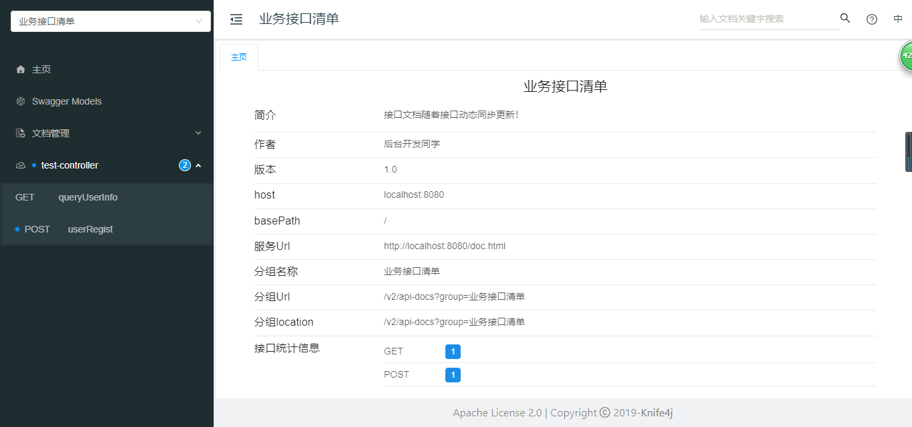

### 3.4.1 测试参数校验

* 请求参数

   * knif4j接口文档调试时自动提示参数不能为空

    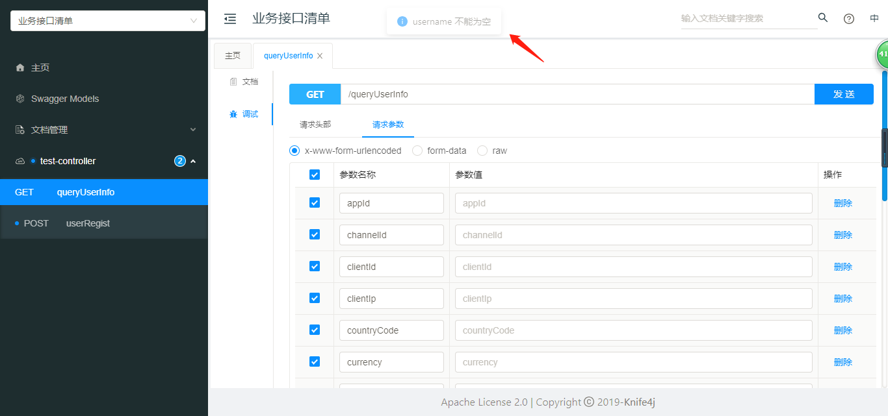

    * 提交非法请求参数

    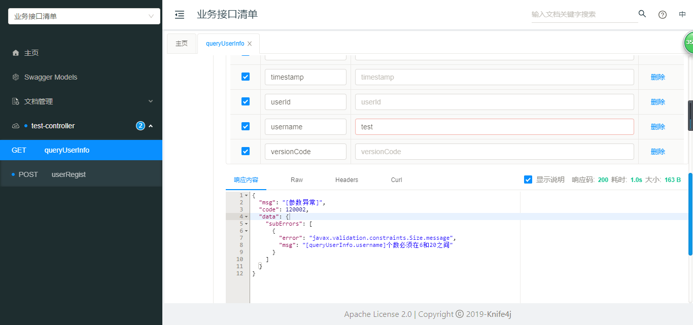

* 结果

    ```json
    {
      "msg": "[参数异常]", #错误信息概览
      "code": 120002, #系统错误码
      "data": {
        "subErrors": [
          {
            "error": "javax.validation.constraints.Size.message",#业务错误码
            "msg": "[queryUserInfo.username]个数必须在6和20之间" #详细错误信息
          }
        ]
      }
    }
    ```

### 3.4.2 测试正常响应信息返回

* 请求参数

    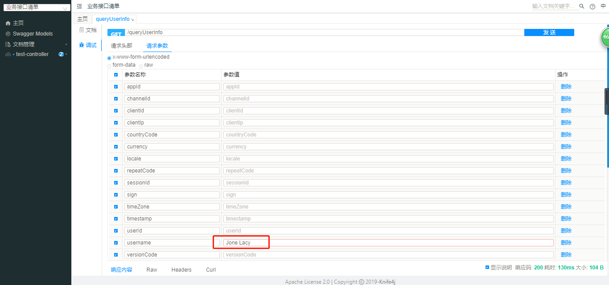

* 结果
     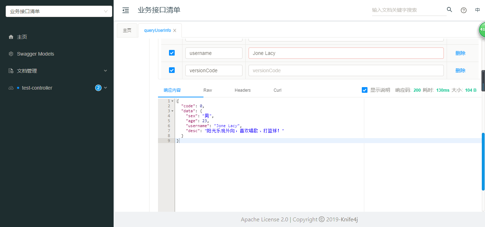

     ```json
     {
       "code": 0,
       "data": {
         "sex": "男",
         "age": 23,
         "username": "Jone Lacy",
         "desc": "阳光乐观外向，喜欢唱歌、打篮球！"
       }
     }
     ```

### 3.4.3 测试业务异常的使用

* 请求参数

    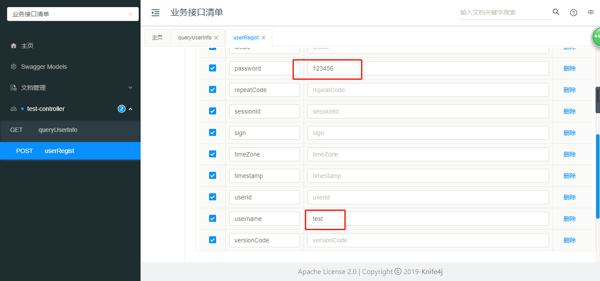

* 结果

    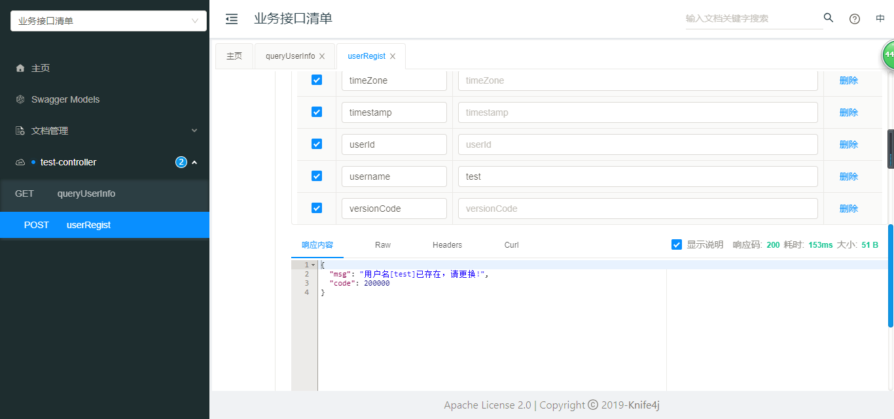

    ```json
    {
      "msg": "用户名[test]已存在，请更换!",
      "code": 200000
    }
    ```

    

## 3.5 更多功能示例

* 系统内置接口

    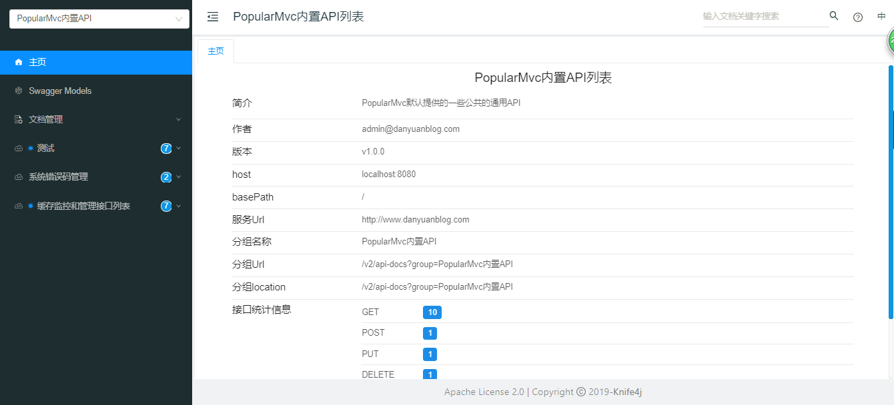

* 业务系统接口

    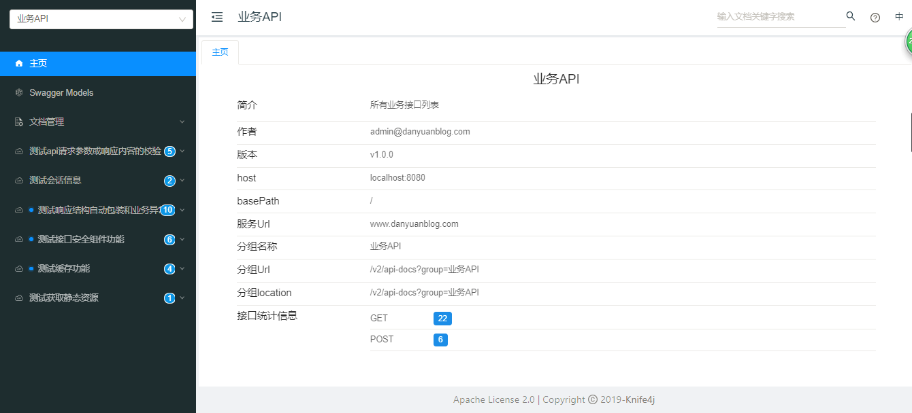

* 接口文档示例

    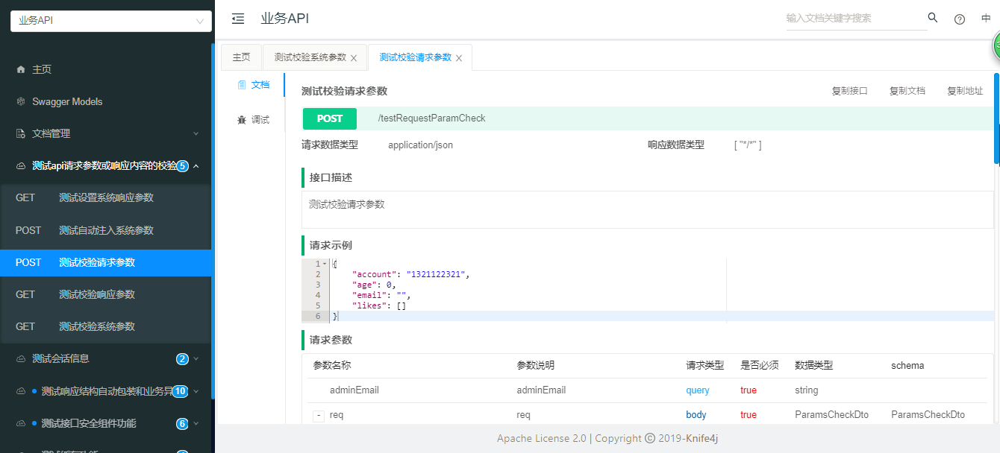

* 接口测试示例

    * 接口参数校验失败测试结果示例

        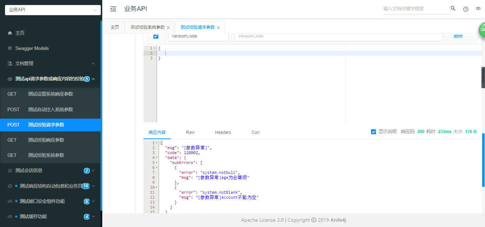

    * 接口访问成功结果示例

        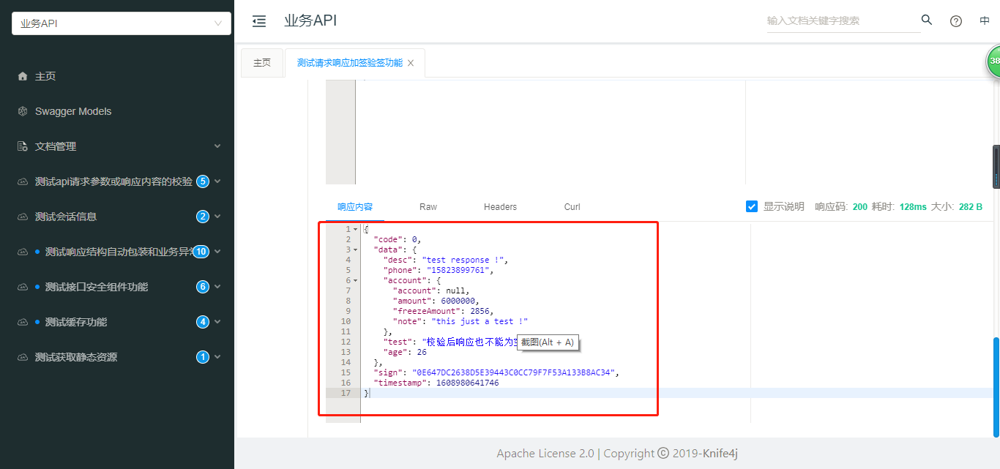

    * 国际化接口访问示例（英文）

        

        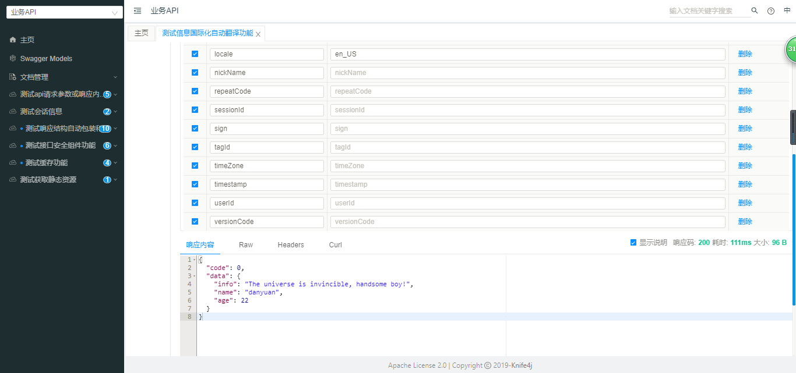

    * 国际化接口访问示例（中文）

        

        

    

# 4、更多特性介绍与使用示例

**[请参考使用示例](demos.md)**

# 5、业务定制化

## 5.1 配置定制化

* 接口文档个性化

* 系统参数定制化
    * 系统公共请求参数名自定义
    * 添加额外的系统公共请求参数
    * 系统公共响应参数名自定义
    * 添加额外的系统响应参数

* 业务国际化内容

    > 可以通过springboot i18n添加或者定制国际化内容

## 5.2 组件定制化

> EasyApi提供了灵活定制通用组件的能力。
>
> 1. 内置的几大管理器都可以替换成自定义的管理器，如：
>     * 缓存管理器
>     * 会话管理器
>     * 国际化管理器
>     * 数字签名管理器
>     * 秘钥管理器
>     * 应用管理器
>     * 接口日志管理器
>     * 接口调用频次控制管理器
> 2. 可以添加自定义接口调用拦截器，实现一些通用业务
> 3. 可以添加自定义接口请求、响应参数装饰器，对参数进行加工
> 4. 可以添加自定义响应序列化预处理器，根据业务需要定制化返回信息
> 5. 可以添加自定义异常处理器，为目标类型的异常做额外的处理
> 6. 可以灵活定制和使用自定义的加解密处理器

# 6、交流与答疑

> ​      此项目的设计初衷源于本人在多年API接口开发经验上，从接口规范、开发便捷易用、配置简单这些角度出发而总结出来的一套API解决方案。通过简单引入EasyApi组件，可以快速搭建一套规范易用的API开发系统。
>
> ​      开源的目的在于，一则希望此项目能帮助更多的研发人员提升API开发质量，提供大量易用的开发套件提升研发人员的开发效率；二则希望更多的人加入到开源中，促进开源项目的成长，然后服务于更多的开发者；其次希望觉得此项目不错的朋友给个Star，分享给更多的朋友，让大家一起进步！
>
> ​      如果在使用此框架的过程中有任何疑问或者好的建议可以通过以下联系方式找到大部队，大家一起交流一起进步！

| 渠道        | 联系地址                                                | 说明                                              |
| ----------- | ------------------------------------------------------- | ------------------------------------------------- |
| QQ群        | 757901536                                               | 可加QQ群，进行技术交流                            |
| 邮箱号      | admin@pddon.com                                   | 有问题也可以发邮件留言                            |
| 留言板      | http://pddon.cn/blog/app/words/msgBoard.html | 通过留言板留言                                    |
| gitee Issue | https://gitee.com/pddon/EasyApi/issues         | 在使用过程中如果遇到问题，可以提Issue，不定时回复 |
| 微信公众号  |                         | 关注公众号不迷路，不定期更新技术文章              |


